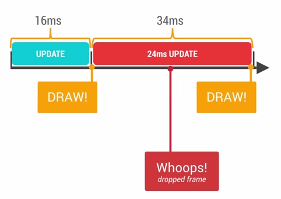

##Render Performance

为什么在使用手机app是由卡顿的感觉，根本原因是因为系统渲染能力缺失。通常为了实现更好的用户体验，我们希望在界面中添加更多设计美观的图片，或者动画等元素，但是由于android系统没能在确定的时间间隔内完成那些复杂元素的渲染，从而导致界面卡顿，也就是所谓的丢帧(drop frame)。
android系统会每隔16ms发出VSYNC信号，触发对UI进行重新渲染，如果每个16ms间隔渲染成功，那么实现屏幕显示帧率60fps，这也意味着大多数操作要在16ms内完成。 

如果你的某个操作耗时为24ms，系统在得到 VSYNC 信号时，由于操作还未完成，那么此时就无法进行正常的渲染，这样在该渲染的时候没有正常的执行，从而出现丢帧，那么用户会在32ms内看到界面上显示同一帧画面。

可能导致丢帧的原因有很多，比如你的layout布局嵌套太过复杂，或者是你的 UI 上层叠太多的绘制单元对象，还有可能是有些动画执行次数过多(重复的动作)，这些都会导致 CPU 或者 GPU 负担过重。

我们可以用一些工具来检测丢帧发生的位置，比如使用 HierarchyViewer 来查看 Activity 布局的嵌套情况，也可以使用手机的开发者选项中的 Show GPU Overdraw等选项进行观察。还可以使用 TraceView 来观察 CPU 的执行情况，快捷的找到性能的瓶颈。 